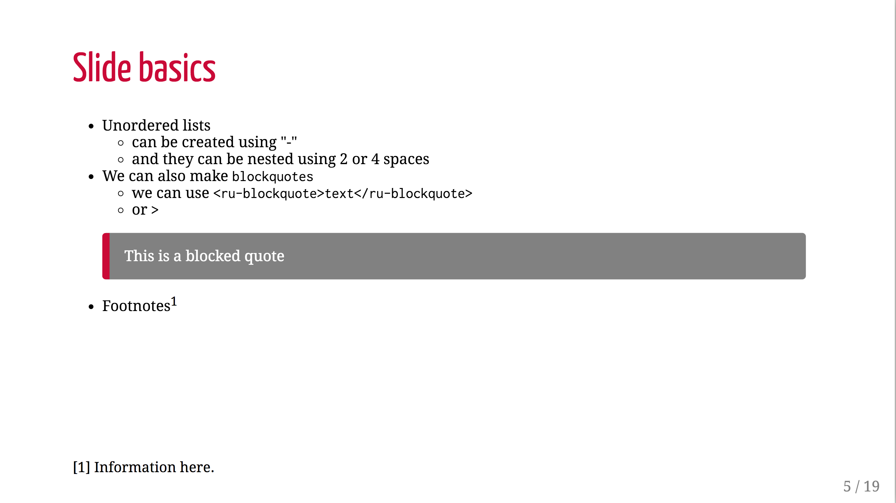
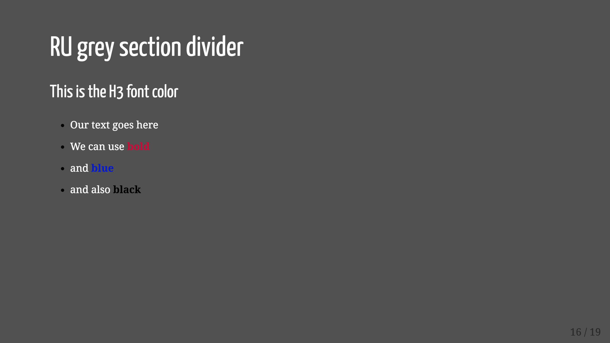
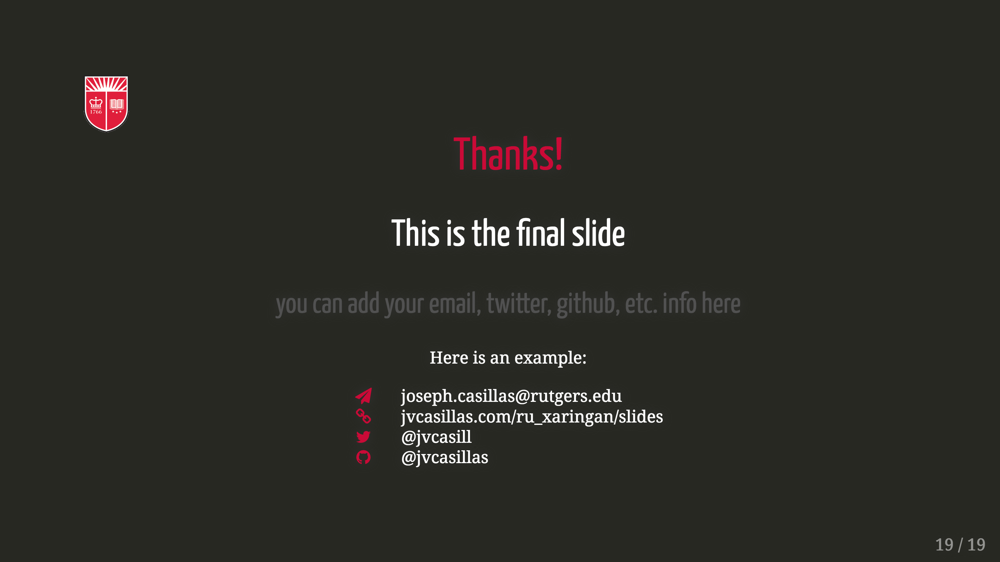

# ru_xaringan

Minimalist xaringan theme for html presentations using RU style/colors

## Examples






Example presentation [here](http://www.jvcasillas.com/ru_xaringan/slides/index.html). 

## Usage

The Rutgers theme is now part of `xaringan` (as of 3/9/2018). You can 
use it by downloading the latest version of `xaringan` and adding `rutgers` 
and `rutgers-fonts` to the `css` call in the yaml front matter: 


```
---
title: "Title here"
subtitle: "Sub-title here"
author: "Your Name"
date: "Rutgers University </br> `r Sys.Date()`"
output:
  xaringan::moon_reader:
    lib_dir: libs
    css: ["rutgers", "rutgers-fonts"]
    nature:
      beforeInit: "http://www.jvcasillas.com/ru_xaringan/js/ru_xaringan.js"
      highlightStyle: github
      highlightLines: true
      countIncrementalSlides: false
      ratio: "16:9"
---
```
