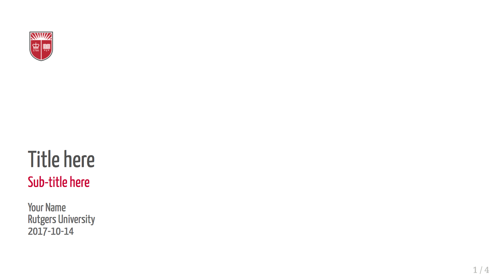

# ru_xaringan_css

RU style theme for xaringan html presentations

## Examples



Example presentation [here](). 

## Usage

```
---
title: "Title here"
subtitle: "Sub-title here"
author: "Your Name"
date: "Rutgers University </br> `r Sys.Date()`"
output:
  xaringan::moon_reader:
    lib_dir: libs
    css: "http://www.jvcasillas.com/ru_xaringan_css/css/ru_xaringan.css"
    nature:
      highlightStyle: github
      highlightLines: true
      countIncrementalSlides: false
      ratio: "16:9"
---
```